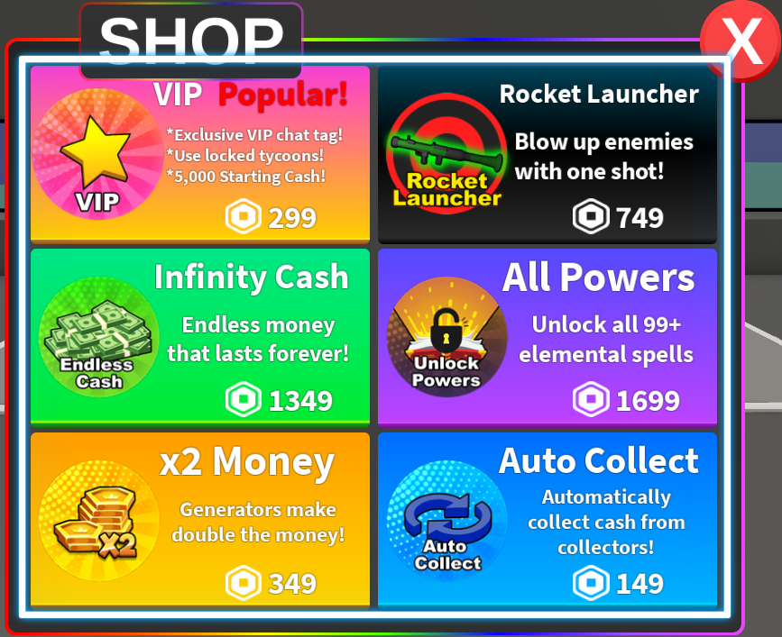
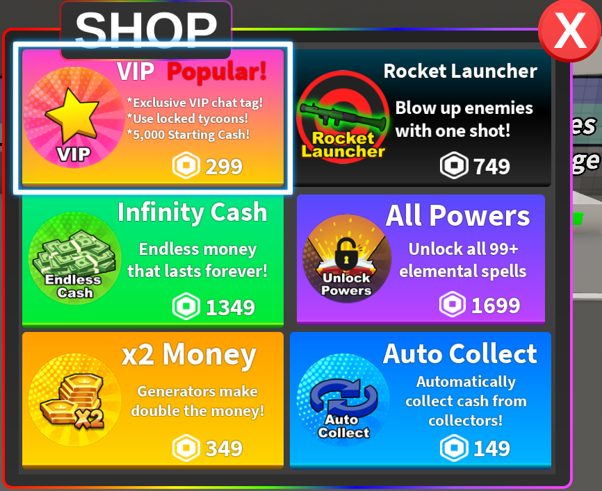

# UI interactions

pyrobloxbot controls the Roblox character mostly by using only the keyboard. (See the [FAQ](faq-keyboard-only) to understand why)

You might then assume that interacting with ui elements like buttons using only pyrobloxbot is impossible, since we can't move the mouse, but this is not the case.

Perhaps you have even already come across (and hated) the feature that enables your bot to do this. The ui navigation mode! When this mode is enabled, using "wasd" or the arrow keys will let you select any ui element on screen, and hitting enter will "click" it.

```{video} ../../_static/ui_navigation/uinavigation.mp4
:autoplay:
:loop:
:muted:
:width: 100%

UI navigation mode example (Epic Minigames)
```

You might have accidentally enabled this and got very annoyed at it, but it is a godsend for making Roblox bots, because it lets us reliably (with some exceptions) automate ui interactions through the keyboard.

(guide-ui-navigation)=
## UI navigation

The best way to do ui navigation (unless you specifically need to scroll up and down through a page, more on that later) is using the {py:func}`pyrobloxbot.ui_navigate` method.

The first thing you'll need to do is figure out the sequence of actions (navigating in some direction or clicking) to do what you want. The best way to do this is simply to try it out manually:

1. Ensure you're figuring things out from what would be previously selected. If, before navigating, your bot had the ui navigation mode turned off, then you want to figure out what element is selected when it gets turned on and work from that one.
2. Use the arrow keys to navigate around until you reach the element you want to click.
3. Repeat 2. if you need to click multiple elements.
4. Write down the sequence of arrow keys you pressed.

Then you can write your ui navigation sequence using {py:func}`pyrobloxbot.ui_navigate`.

For example, say there's some game where you want to open a shop, sell an item, and close the shop, and you've determined the sequence to do that, from having the ui navigation mode off, is:
<br>`down` -> `down` -> `click` -> `right` -> `up` -> `click` -> `up` -> `click`

Then you can simply call {py:func}`pyrobloxbot.ui_navigate` with those arguments, and it will execute that sequence:
```python
import pyrobloxbot as bot

bot.toggle_ui_navigation()
bot.ui_navigate("down", "down", "click", "right", "up", "click", "up", "click")
bot.toggle_ui_navigation()
```

```{tip}
:name: tip-ui-elements-seem-unclickable

Sometimes you might find that hitting enter doesn't actually click the selected element!

This is because in some, due to how the ui elements are organized, the element you're selecting might not actually be clickable for some reason.

One thing you can try in this situation is navigating in some direction after selecting it and trying to click.
```

`````{warning}
Instead of manually toggling the ui navigation mode every time, you might choose to use the {py:attr}`pyrobloxbot.options.auto_ui_navigation_mode<pyrobloxbot.bot.options._BotOptions.auto_ui_navigation_mode>` option.

But **be careful!**

This option relies on pyrobloxbot's internal tracking of whether the ui navigation mode is enabled or not in game.

However, this can actually get desynced from what's actually true in game, because closing a ui element like a frame can cause the ui navigation mode to get disabled, and there's no way to track that automatically.

The same is true for the {py:func}`pyrobloxbot.enable_ui_navigation` and  {py:func}`pyrobloxbot.disable_ui_navigation` functions. They also rely on pyrobloxbot tracking the state ui navigation mode in game.

When using this option, be very careful of these desyncs, as they'll almost always cause your bot to break completely!

````{important}
It's also important to note that, even if you enable {py:attr}`pyrobloxbot.options.auto_ui_navigation_mode<pyrobloxbot.bot.options._BotOptions.auto_ui_navigation_mode>`, you still need to manually enable and disable the ui navigation mode if you want to use more than one ui navigation method in sequence.

For example, if you wanted to do:
```python
import pyrobloxbot as bot

bot.enable_ui_navigation()

bot.ui_navigate_down(3)
bot.ui_click()
bot.ui_navigate_right(2)
bot.ui_click()

bot.disable_ui_navigation()
```

Without the `bot.enable_ui_navigation()` and `bot.disable_ui_navigation()` lines, the ui navigation mode would be turned off after each action, making them not behave as you'd expect.

````

`````

## Scrolling

Like mentioned before, the only action that can't be done using {py:func}`pyrobloxbot.ui_navigate` is scrolling. It is instead done through {py:func}`pyrobloxbot.ui_scroll_up` and {py:func}`pyrobloxbot.ui_scroll_down`.

So, to use the ui scrolling functions, you must do:
```python
import pyrobloxbot as bot

bot.toggle_ui_navigation()

bot.ui_navigate("left", "click", "right", "down", "right")
bot.ui_scroll_down(5) # Scroll down 5 ticks
bot.ui_navigate("down", "down", "click")

bot.toggle_ui_navigation()
```

Its also worth checking if you're able to scroll down just by selecting one of the elements and navigating up and now, eliminating the need to use {py:func}`pyrobloxbot.ui_scroll_up` and {py:func}`pyrobloxbot.ui_scroll_down`.

```{note}
To use the scroll functions, it is important that you select the right element. <br>You must select the container that is actually scrollable, not one of the elements inside it:

| ✅ Correct | ❌ Wrong |
| :---: | :---: |
|  |  |
| *The correct element to select* | *The wrong element to select* |
```
